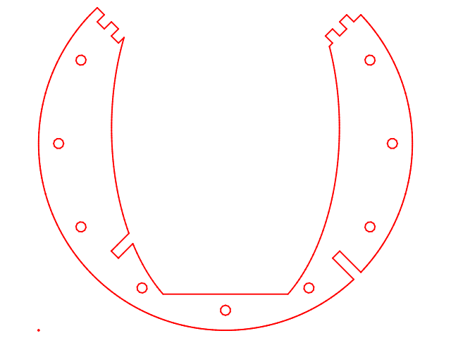

Sudiball   
========

##Skeletal gimbal mount
###It's like a ball but less. 

To play with the models yourself you will need to
install a recent __stable__ version of OpenSCAD  
(You may need to get a recent version from <http://www.openscad.org/>)

I am focusing the software on easily built "standard" versions
where the planes intersect at right angles in the center of the ball. 

To facilitate visual experimentation prior to generating 2D or 3D
files, the scripts are divided into four modules.

__sudiconfig.scad__:  Where you will edit parameters (use any text editor)   
__sudiview.scad__:	 Open with OpenSCAD to see changes from parameters edited  
__sudigen.scad__:	 Open with OpenSCAD to generate parts seen in sudiview  
__sudilib.scad__:	Common routines used by both sudiview & sudigen.   

Workflow is: with all four files in the same directory:  
1.  open the _sudiconfig.scad_ file in your favorite text editor  
  (you can also use OpenSCAD as your editor but will need to switch files more  
2.  open sudiview.scad_ in OpenSCAD and have it render (hit F5)  
3.  Edit the _sudiconfig.scad_ file to suit your needs  
4.  Hit F5 to render your changes in the OpenScad window running sudiview.scad_  
5.  Rinse and repeat the previous two steps to your hearts content  
6.  For 3D files just choose the format you want and __Export__ it.  
7.  For 2D files of one flat sheet

------------------------------------------------------------------------
For more information see:
  
- My page with other ATM related
https://ix.cs.uoregon.edu/~tomc/Hobbies/Astronomy/ATM/index.html  
 
- A short informal paper
http://ix.cs.uoregon.edu/~tomc/Hobbies/Astronomy/ATM/SudiBall.pdf

- Initial set of vector files (circa 2013)  
[SVG,DXF,PDF](vector_files/)  
[Initial OpenSCAD SudiBall Template](Mark_I/sudiball_template.scad/)

------------------------------------------------------------------------
--2013 Jul 31 - 2013 Aug 07

In the spirit of moving from the theoretical "you can design anything you want" 
to the more practical -- this is the simplest Sudiball to build with everyday tools and materials. 

CAD drawings and print files of my first generic Sudiball are in the [Vector Files](/vector_files/) directory. 
There are two sizes of vector drawing and four formats in the
Both are designed to use 3/4" material. 
So far, the 24" has been scaled in half and used with 3/8" material 
and to a third to use 1/4" material. 

The Postscript can be printed on paper glued to whatever and cut out for quick tests 
the DXF may need some cleanup before feeding to a machine, i.e cross-hairs removed.
The important part here is the slots are just 90 degree cuts 
and cutting the entire profile at 90 degrees does not interfere 
with making the compound curve on the runners as a separate operation. 
This means the profiles may be cut with a laser, waterjet, CNC router, milling machine 
or by hand with a router or saw.

The compound curve on the runners of a two foot diameter Sudiball with a 3/4" thick edge 
is under six thousandths of an inch, since the square edge is tangent to the sphere. 
This means just breaking the edge with sandpaper does a pretty good job of forming the desired curve.
i.e. Sticking adhesive back sandpaper to the ground ring and swirling it about is enough.

--------------------------------------------------------------------------------

--2017 March  
A couple of incremental update notes.
First regarding a base which can be a simple ring.  
The SudiBall must contact the ring in at least three places which limits the
diameter of the supporting ring to be not smaller than
the height of the triangle formed by the intersecting runners.
(height is measured from the center of the base to the apex of an equlateral triangle)
 
It is easy to unedrestimate the lateral forces in play which to tend to distort
the ring from circular to a trifoil or warped from a plane.
Even small distortions will cause a TIC! when a runner contacts the support ring broadside.

Two ways to mitigate.
- Make a stronger ring support.  
- Ease the approach onto the support.

The first needs whatever works, the second is geometery.
If the support surface is flat and nearly _normal_ or _tangent_ to the curve
of the SudiBall it forms little "on ramps" whos easement is related the the width
of of the flat surface.

It also allows covering the support surface with a (replacable)    
sheet material i.e. metal or fancy plastics cut into a strip with a [Cone Calculator](https://duckduckgo.com/?q=cone+calculator&ia=web)

Joining the tips of a sudiball together can be tricky if joinery is not also your dayjob
but by cutting interlocking fingers into the ends of the runners you get a
simple solid connection called a fingerjoint   

------------------------------------------------------------------------

If you do something fun with these let me know I will set up a rouges gallery at some point.

Please email sudiball360@gmail.com for more info.
